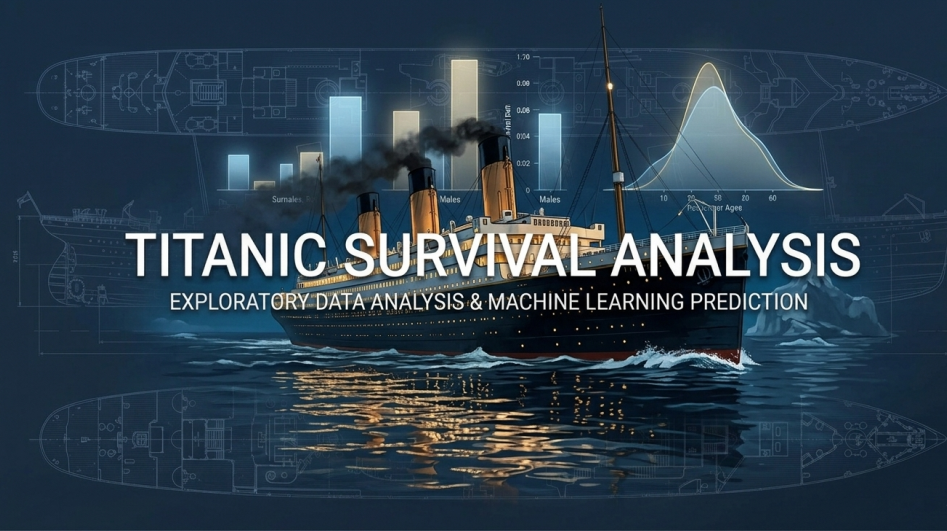
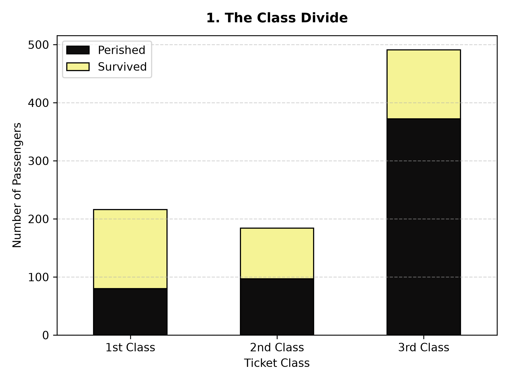
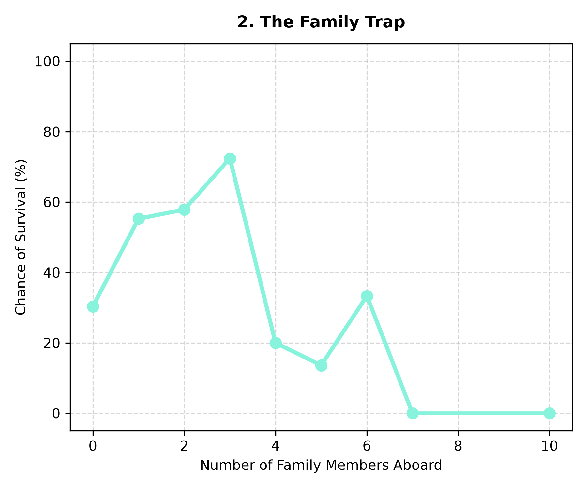
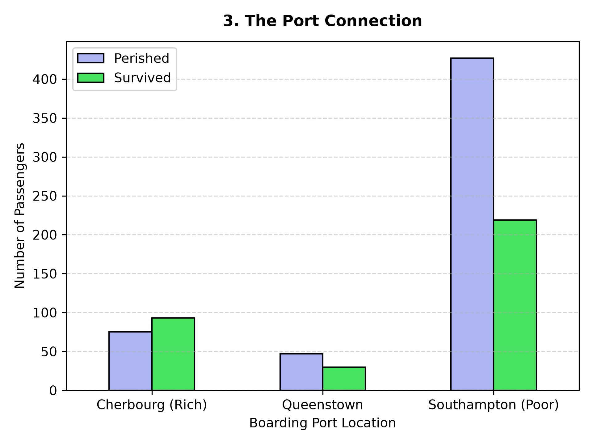

# 🚢 Titanic Data Analysis


A streamlined Python project that cleans the classic Titanic passenger dataset and automates the creation of key demographic survival charts.

## 📊 Visual Insights

| 1. Class Distribution | 2. Family Impact | 3. Port Connections |
| :---: | :---: | :---: |
|  |  |  |

---

## 💾 Data Pipeline

*   **Source Data**: Uses the official `train.csv` downloaded directly from the [Kaggle Titanic Competition](https://kaggle.com).
*   **Cleaned Output**: Cleans missing values, handles data types, and exports a fully processed production file to `titanic_cleaned_data.xlsx`.

---

## 🛠️ Built With

- **Pandas & NumPy**: For efficient data wrangling and numerical processing.
- **Openpyxl**: For exporting structured data into Excel format.
- **Matplotlib & Pillow**: For rendering and saving clean data visualizations.

---

## 🚀 Quick Start

### 1. Set Up Environment
Activate your virtual environment and install the required dependencies:

```bash
# Activate venv (Windows)
.\venv\Scripts\activate

# Install requirements
pip install pandas openpyxl matplotlib pillow numpy
```

### 2. Run the Analysis
Execute the script to clean the raw data and refresh all three graphs:

```bash
python titanic_analysis.py
```

## 📂 Project Structure
- `train.csv` — Raw Kaggle training data.
- `titanic_cleaned_data.xlsx` — Final processed and cleaned Excel file.
- `titanic_analysis.py` — Core Python data execution pipeline.


